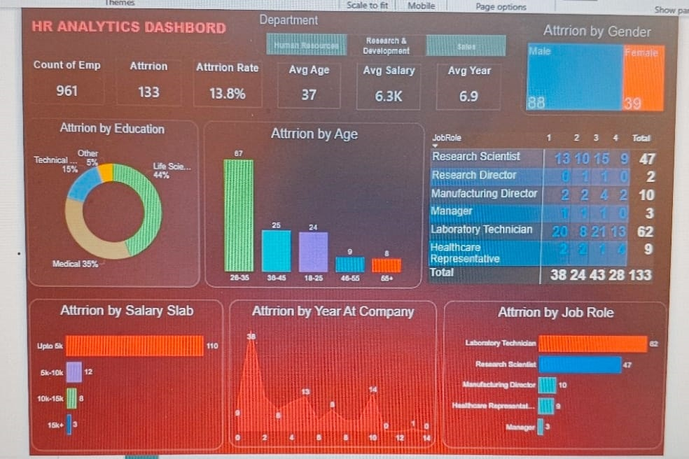

# HR Analytics Dashboard | Power BI

## 📌 Project Overview

The **HR Analytics Dashboard** is an interactive Business Intelligence project developed using **Microsoft Power BI**. The objective of this project is to analyze employee data, identify workforce trends, and provide actionable insights related to employee attrition, demographics, salary, job satisfaction, and departmental performance.

This dashboard enables HR professionals and business stakeholders to make data-driven decisions by transforming raw HR data into meaningful visualizations.

---

## 🎯 Project Objectives

* Analyze employee attrition trends.
* Monitor workforce demographics.
* Compare attrition across departments and job roles.
* Identify high-risk employee groups.
* Evaluate salary distribution and employee satisfaction.
* Build an interactive dashboard for HR decision-making.

---

## 📊 Key Performance Indicators (KPIs)

* Total Employees
* Active Employees
* Attrition Count
* Attrition Rate (%)
* Average Employee Age
* Average Monthly Income
* Average Years at Company
* Gender Distribution
* Department-wise Employees
* Job Role Distribution

---

## 📈 Dashboard Features

* Executive HR Overview
* Department-wise Attrition Analysis
* Gender-wise Employee Distribution
* Age Group Analysis
* Education Field Analysis
* Monthly Income Distribution
* Job Satisfaction Analysis
* Years at Company Analysis
* Interactive Filters and Slicers
* Dynamic Visualizations

---

## 🛠 Tools & Technologies

* Microsoft Power BI
* Power Query
* DAX (Data Analysis Expressions)
* Microsoft Excel / CSV
* Data Cleaning
* Data Transformation
* Data Visualization

---
## 📂 Project Structure

```text
HR-Analytics-Dashboard/
│
├── Dashboard.png
├── HR Analytics dashboard.pbix
├── HR_Analytics data.csv
└── README.md

---

## 📁 Dataset Information

The dataset contains employee information such as:

* Employee ID
* Age
* Gender
* Department
* Job Role
* Education
* Marital Status
* Monthly Income
* Job Satisfaction
* Years at Company
* Attrition Status
* Overtime
* Business Travel
* Performance Rating
* Work-Life Balance

---

## 📌 Business Questions Answered

* Which department has the highest employee attrition?
* Which job roles experience the highest turnover?
* Does age impact attrition?
* How does monthly income relate to employee retention?
* Which education fields have higher attrition rates?
* What is the overall employee retention percentage?
* Which employee groups require immediate HR attention?

---


## 💡 Key Insights

* Identified departments with the highest attrition rates.
* Highlighted employee segments with increased turnover.
* Compared salary distribution across departments.
* Analyzed demographic patterns affecting retention.
* Built interactive visuals for quick HR reporting.
* Enabled data-driven workforce planning.

---

## 🚀 How to Use

1. Clone this repository.
2. Download the project files.
3. Open the `.pbix` file using Microsoft Power BI Desktop.
4. Refresh the dataset if required.
5. Explore the dashboard using filters and slicers.

---

## 📷 Dashboard Preview



*Interactive HR Analytics Dashboard developed using Microsoft Power BI.*


---

## 📈 Skills Demonstrated

* Data Cleaning
* Data Modeling
* ETL using Power Query
* DAX Measures
* Dashboard Design
* Business Intelligence
* Data Visualization
* HR Analytics
* KPI Reporting
* Interactive Reporting
* Analytical Thinking

---

## 🎯 Business Value

This dashboard helps HR teams:

* Monitor workforce health.
* Improve employee retention.
* Identify attrition patterns.
* Support strategic hiring decisions.
* Enhance workforce planning using data-driven insights.

---

## 🔮 Future Improvements

* Predictive Attrition Analysis using Machine Learning.
* Employee Performance Dashboard.
* Recruitment Analytics Dashboard.
* Diversity & Inclusion Dashboard.
* Automated Data Refresh.
* Power BI Service Deployment.

---

## 👨‍💻 Author

** Sachin Kushwaha**

Aspiring Data Analyst | Power BI | SQL | PostgreSQL | Excel | Python

GitHub: https://github.com/sachinkushwaha5523-ops


---

## ⭐ If you found this project useful

If you like this project, consider giving it a ⭐ on GitHub. Your support is appreciated!
